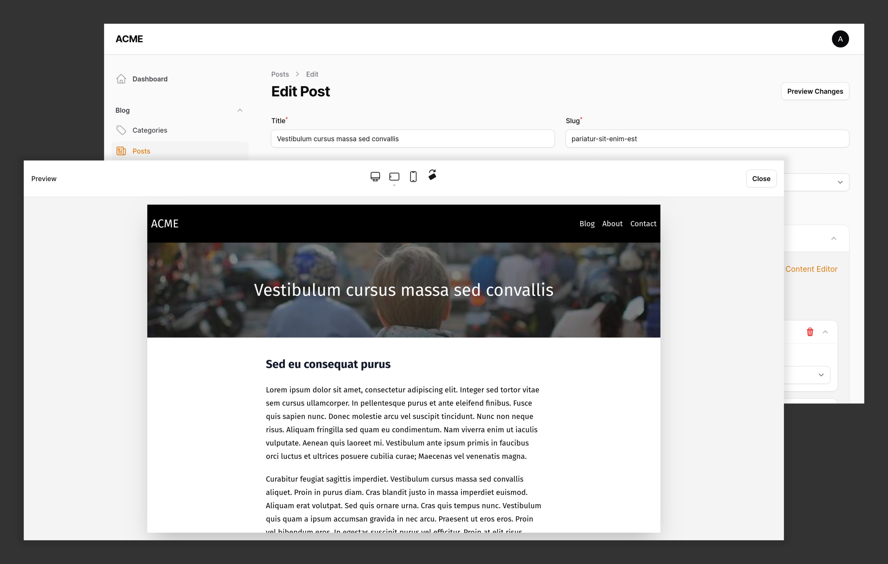

# Page Previews



## Overview

Clicking the preview action button at the top of the page opens a full-screen modal. The modal contains an iframe that can be resized according to some configured presets. The iframe can either render a full Blade view or a custom URL.

Opening and closing the preview modal does not update the record in the database, the form state is unchanged.

## Using the Preview Modal with Blade Views

In your `Edit` page, start by adding the `HasPreviewModal` trait:

```php
use Pboivin\FilamentPeek\Pages\Concerns\HasPreviewModal;

class EditPost extends EditRecord
{
    use HasPreviewModal;

    // ...
```

Add the `PreviewAction` class to the page actions:

```php
use Pboivin\FilamentPeek\Pages\Actions\PreviewAction;

protected function getActions(): array
{
    return [
        PreviewAction::make(),
    ];
}
```

Then, add the `getPreviewModalView()` method to define your Blade view:

```php
protected function getPreviewModalView(): ?string
{
    // This corresponds to resources/views/posts/preview.blade.php
    return 'posts.preview';
}
```

Optionally, if your Blade view expects a `$post` variable, add the `getPreviewModalDataRecordKey()` method to define the variable name:

```php
protected function getPreviewModalDataRecordKey(): ?string
{
    return 'post';
}
```

By default, the variable will be `$record`.

#### Complete Example

**`app/Filament/Resources/PostResource/Pages/EditPost.php`**

```php
namespace App\Filament\Resources\PostResource\Pages;

use App\Filament\Resources\PostResource;
use Filament\Resources\Pages\EditRecord;
use Pboivin\FilamentPeek\Pages\Actions\PreviewAction;
use Pboivin\FilamentPeek\Pages\Concerns\HasPreviewModal;

class EditPost extends EditRecord
{
    use HasPreviewModal;

    protected static string $resource = PostResource::class;

    protected function getActions(): array
    {
        return [
            PreviewAction::make(),
        ];
    }

    protected function getPreviewModalView(): ?string
    {
        return 'posts.preview';
    }

    protected function getPreviewModalDataRecordKey(): ?string
    {
        return 'post';
    }
}
```

**Note**: Previews can be added on all types of pages: `View`, `Create`, `List` and custom pages.

## Detecting the Preview Modal

The example above uses a dedicated Blade view to be rendered in the preview modal. It's also possible to use the same view for the site page and the preview modal. In this case, you can detect if the view is being used for a preview by checking for the `$isPeekPreviewModal` variable:

**`resources/views/posts/show.blade.php`**

```blade
<x-layout>
    @isset($isPeekPreviewModal)
        <x-preview-banner />
    @endisset

    <x-container>
        ...
    </x-container>
</x-layout>
```

## Adding Extra Data to Previews

By default, the `$record` and `$isPeekPreviewModal` variables are made available to the rendered Blade view. If your form is relatively simple and all fields belong directly to the record, this may be all you need. However, if you have complex relationships or heavily customized form fields, you may need to include some additional data in order to render your page preview. You can do so with the `mutatePreviewModalData()` method:

```php
protected function mutatePreviewModalData(array $data): array
{
    $data['message'] = 'This is a preview';

    return $data;
}
```

This would make a `$message` variable available to the Blade view when rendered in the iframe.

Inside of `mutatePreviewModalData()` you can access:

| What | Where |
|---|---|
| The modified record with unsaved changes | `$data['record']` |
| The original record | `$this->record` |
| Any other field from the form | `$this->data['my_custom_field']` |

## Alternate Templating Engines

If you're not using Blade views on the front-end, override the `renderPreviewModalView()` method and render the preview with your solution of choice:

```php
protected function renderPreviewModalView(string $view, array $data): string
{
    return MyTemplateEngine::render($view, $data);
}
```

## Using a Preview URL

Instead of rendering a view, you may implement page previews using a custom URL and a storage driver such as the Laravel Cache or the PHP session. Instead of `getPreviewModalView()`, use the `getPreviewModalUrl()` method to define the preview URL:

```php
protected function getPreviewModalUrl(): ?string
{
    $token = uniqid();

    $sessionKey = "preview-$token";

    session()->put($sessionKey, $this->previewModalData);

    return route('posts.preview', ['token' => $token]);
}
```

Then, you can fetch the preview data from the controller:

```php
class PostController extends Controller
{
    // ...

    public function preview($token)
    {
        $previewData = session("preview-$token");

        abort_if(is_null($previewData), 404);

        // ...
    }
}
```

#### Filament as Headless CMS

This technique can also be used to implement page previews with a decoupled front-end (e.g. Next.js):

- From `getPreviewModalUrl()`, generate the preview token and return a front-end preview URL. This would usually render a full page component.
- From the front-end page component, fetch the preview data from the back-end preview URL, as shown above.

See also: [JavaScript Hooks](./javascript-hooks.md)

## Embedding a Preview Action into the Form

Instead of a `PreviewAction`, you can use the `InlinePreviewAction` component to integrate a button directly into your form (e.g. in a sidebar):

```php
use Filament\Forms\Components\Actions;
use Pboivin\FilamentPeek\Forms\Actions\InlinePreviewAction;

public static function form(Form $form): Form
{
    return $form->schema([
        Actions::make([
            InlinePreviewAction::make()
        ]),

        // ...
    ]);
}
```

By default, the action is styled as a primary link. Use the `button()` method to style it as a Filament button.

Use one of the following methods on the `Actions` wrapper to adjust the horizontal alignment:

- `alignStart()`
- `alignCenter()`
- `alignEnd()`
- `alignJustify()`

## Preview Pointer Events

By default, only scrolling is allowed in the preview iframe. This is done by inserting a very small `<style>` tag at the end of your preview's `<body>`. If this doesn't work for your use-case, you can enable all pointer events with the [`allowIframePointerEvents` option](./configuration.md).

If you need finer control over pointer events in your previews, first set this option to `true` in the configuration. Then, in your page template, add the required CSS or JS. Here's an example disabling preview pointer events only for `<a>` tags:

**`resources/views/posts/show.blade.php`**

```blade
...

@isset($isPeekPreviewModal)
    <style>
        a { pointer-events: none !important; }
    </style>
@endisset
```

---

**Documentation**

<!-- BEGIN_TOC -->

- [Configuration](./configuration.md)
- [Page Previews](./page-previews.md)
- [Builder Previews](./builder-previews.md)
- [JavaScript Hooks](./javascript-hooks.md)
- [Upgrading from v1.x](./upgrade-guide.md)

<!-- END_TOC -->
